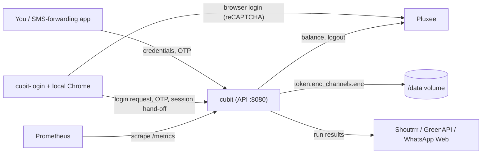

# Cubit

[](LICENSE)
[](go.mod)

Cubit reads your Israeli **Cibus / Pluxee** meal-card balance and tells you how
many fixed-denomination vouchers it buys.

```
Cibus balance : ₪273.50
Voucher value : ₪50.00
Affordable    : 5 vouchers
Remainder     : ₪23.50
```

It is a small self-hosted Go service: one static binary, a ~22 MB `scratch`
container, a JSON API, and Prometheus metrics.
A companion helper, `cubit-login`, handles the one step that needs a real
browser: logging in past Pluxee's reCAPTCHA.

> **Stage 1.** Cubit reports. It does **not** buy anything — no cart, no orders,
> no scheduling. Purchasing is deliberately out of scope.

## Contents

- [Features](#features)
- [How it works](#how-it-works)
- [Requirements](#requirements)
- [Installation](#installation)
- [Quick start](#quick-start)
- [Configuration](#configuration)
- [HTTP API](#http-api)
- [Notifications](#notifications)
- [Metrics](#metrics)
- [Authentication](#authentication)
- [Re-authenticating with `cubit-login`](#re-authenticating-with-cubit-login)
- [The voucher maths](#the-voucher-maths)
- [Security](#security)
- [A caveat worth reading](#a-caveat-worth-reading)
- [Troubleshooting](#troubleshooting)
- [Development](#development)
- [Contributing](#contributing)
- [Licence](#licence)

---

## Features

- Reads the Cibus / Pluxee balance and computes how many vouchers of a
  configurable denomination it covers, and what is left over.
- Integer-only money (agorot), so no floating-point rounding errors.
- OTP-based login state machine (`IDLE` → `AWAITING_OTP` → `AUTHENTICATED`),
  driven over a JSON API.
- Session **encrypted at rest** with AES-256-GCM, so restarts usually need no
  new code.
- Browser-assisted login helper (`cubit-login`) that drives a local Chrome to
  get past Pluxee's reCAPTCHA, with an optional watch mode.
- Notifications after every balance check via Shoutrrr (Slack, Discord,
  Telegram, Gotify, SMTP, ntfy, …), GreenAPI (WhatsApp) or a self-hosted
  WhatsApp Web gateway. Channel credentials are encrypted at rest and redacted
  in the API.
- Prometheus metrics at `/metrics`, plus `/healthz` and `/readyz` probes.
- Optional API token (header or basic auth), compared in constant time.
- Swagger UI at `/api/docs`, with embedded assets and an OpenAPI 3 spec that a
  test keeps in sync with the router.
- Configuration by YAML, `CUBIT_*` environment variables, or flags.
- `scratch` container running as uid 10001; multi-arch builds for
  `linux/amd64`, `linux/arm64` and `linux/arm/v7`.

## How it works

Pluxee sends a one-time code out of band, so Cubit cannot log in unattended. A
login parks in `AWAITING_OTP` and waits for you to hand it the code:

```
IDLE ──login──> AWAITING_OTP ──otp──> AUTHENTICATED
  ^                  │                      │
  └── ttl / attempts ─┘   ── 401 / expiry ──┘
```

The resulting session is **encrypted to disk with AES-256-GCM**, so a restart
normally goes straight back to `AUTHENTICATED` without a new code. That is what
makes the service usable day to day.

Because Pluxee's login endpoint also enforces reCAPTCHA (see
[A caveat worth reading](#a-caveat-worth-reading)), the login itself is performed
by `cubit-login` in a real browser, which then hands the session to Cubit:



On startup Cubit restores the session from `token.enc` if it is still valid and
reads the balance at once. Each successful balance check is printed to stdout,
recorded in the metrics, and sent to the matching notification channels.

## Requirements

- A Cibus / Pluxee account and access to the phone that receives its one-time
  codes.
- A 32-byte encryption key (raw, hex or base64) for the data at rest.
- Docker, or Go 1.26+ to build from source.
- For logging in: a machine with Chrome or Chromium installed to run
  `cubit-login`. It can be a different machine from the one running Cubit, as
  long as it can reach Cubit's API.

## Installation

> **No published artifacts yet.** There are no GitHub Releases and no image on
> Docker Hub or GHCR at the moment, so build from source. The release pipeline
> is in place (see [Releases](#releases)); once it has run, binaries will be
> attached to GitHub Releases and the image pushed to Docker Hub under the
> account in the `DOCKERHUB_USERNAME` secret (`docker-compose.yml` expects
> `techblog/cubit`).

### Docker image (build locally)

```bash
git clone https://github.com/t0mer/cubit.git
cd cubit
docker build -t techblog/cubit:latest --build-arg VERSION=dev .
```

Tagging it `techblog/cubit:latest` lets the bundled
[`docker-compose.yml`](docker-compose.yml) use it as is.

### Binaries from source

```bash
go build -o cubit       ./cmd/cubit
go build -o cubit-login ./cmd/cubit-login
```

Add `-ldflags "-X github.com/t0mer/cubit/internal/version.Version=<version>"`
to stamp a version into either binary.

`cubit-login` is **not** in the container image — it needs a browser, and Cubit
stays a static binary on `scratch`. Release archives, once published, include it
separately for Linux, macOS and Windows on amd64 and arm64.

## Quick start

1. **Start Cubit** with an encryption key and an API token. The token is
   required for the credentials and browser-handoff endpoints.

   ```bash
   export CUBIT_SERVER_API_TOKEN="$(head -c 24 /dev/urandom | base64)"
   docker run -d --name cubit \
     -p 8080:8080 \
     -v cubit-data:/data \
     -e CUBIT_AUTH_ENCRYPTION_KEY="$(head -c 32 /dev/urandom | base64)" \
     -e CUBIT_SERVER_API_TOKEN \
     techblog/cubit:latest
   ```

   **Keep the volume and the key.** The volume holds the encrypted session; lose
   it — or lose `CUBIT_AUTH_ENCRYPTION_KEY` — and the next start needs a fresh
   code. Store the key somewhere safe rather than generating it inline every
   time.

2. **Run the login helper** in watch mode on a machine with Chrome:

   ```bash
   cubit-login --watch --url http://localhost:8080 --token "$CUBIT_SERVER_API_TOKEN"
   ```

3. **Post your credentials.** That starts the login, and Pluxee texts you a
   code:

   ```bash
   curl -X POST http://localhost:8080/api/v1/auth/credentials \
        -H "X-API-Token: $CUBIT_SERVER_API_TOKEN" \
        -H 'Content-Type: application/json' \
        -d '{"username":"0501234567","password":"..."}'
   ```

4. **Submit the code:**

   ```bash
   curl -X POST http://localhost:8080/api/v1/auth/otp \
        -H "X-API-Token: $CUBIT_SERVER_API_TOKEN" \
        -H 'Content-Type: application/json' \
        -d '{"code":"123456"}'
   ```

5. **Read the balance:**

   ```bash
   curl -s -H "X-API-Token: $CUBIT_SERVER_API_TOKEN" \
        http://localhost:8080/api/v1/balance | jq
   ```

If you set `CUBIT_PLUXEE_USERNAME` and `CUBIT_PLUXEE_PASSWORD` instead of
posting them, Cubit tries a direct login on boot (`CUBIT_AUTH_AUTOSTART`). As long
as Pluxee demands a captcha, that attempt fails and is logged; run `cubit-login`
without `--watch` (see [below](#re-authenticating-with-cubit-login)) to log in.

### Docker Compose

```bash
export CIBUS_USER='0501234567' CIBUS_PASS='...'
export CUBIT_KEY="$(head -c 32 /dev/urandom | base64)"
docker compose up -d
```

See [`docker-compose.yml`](docker-compose.yml). It passes the credentials and
key through as `CUBIT_PLUXEE_USERNAME`, `CUBIT_PLUXEE_PASSWORD` and
`CUBIT_AUTH_ENCRYPTION_KEY`, and it uses a **named volume**, not a bind mount:
the image runs as uid 10001 and a root-owned host directory would not be
writable. The file sets no API token; add `CUBIT_SERVER_API_TOKEN` to its
`environment` before exposing the port, or to use `cubit-login`.

## Configuration

Precedence: **flags > environment > YAML file > built-in defaults.** Only flags
you actually pass override the environment.

The YAML file is read from `/config/config.yaml` by default (change it with
`--config`); a missing file is fine, a malformed one is an error. See
[`config/config.yaml.example`](config/config.yaml.example).

Every setting has a `CUBIT_`-prefixed environment variable: the YAML key in
upper case with dots replaced by underscores.

| YAML key | Environment variable | Flag | Default | Description |
|---|---|---|---|---|
| `server.address` | `CUBIT_SERVER_ADDRESS` | `--address` | `:8080` | Listen address |
| `server.api_token` | `CUBIT_SERVER_API_TOKEN` | — | — | Guards `/api/v1` and `/metrics`; at least 16 characters. Empty leaves them open |
| `pluxee.username` | `CUBIT_PLUXEE_USERNAME` | — | — | Cibus/Pluxee username; optional if posted to the API |
| `pluxee.password` | `CUBIT_PLUXEE_PASSWORD` | — | — | Cibus/Pluxee password; optional if posted to the API |
| `pluxee.company` | `CUBIT_PLUXEE_COMPANY` | — | — | Only if your employer's login asks for it |
| `pluxee.restaurant_id` | `CUBIT_PLUXEE_RESTAURANT_ID` | `--restaurant-id` | `31999` | Restaurant the report is labelled with |
| `pluxee.timeout` | `CUBIT_PLUXEE_TIMEOUT` | — | `30s` | Per-request timeout |
| `pluxee.language` | `CUBIT_PLUXEE_LANGUAGE` | — | `he` | `Accept-Language` sent upstream |
| `pluxee.recaptcha_token` | `CUBIT_PLUXEE_RECAPTCHA_TOKEN` | — | — | Only if login starts demanding a captcha (see the caveat below) |
| `pluxee.auth_base` | `CUBIT_PLUXEE_AUTH_BASE` | — | `https://api.capir.pluxee.co.il` | Pluxee authentication backend |
| `pluxee.api_base` | `CUBIT_PLUXEE_API_BASE` | — | `https://api.consumers.pluxee.co.il/api/main.py` | Pluxee backend that serves balances |
| `voucher.value_agorot` | `CUBIT_VOUCHER_VALUE_AGOROT` | `--voucher-value` | `5000` | Voucher denomination in agorot (₪50); must be positive |
| `auth.autostart` | `CUBIT_AUTH_AUTOSTART` | `--autostart` | `true` | Try a login on boot when credentials are configured and no session is held |
| `auth.otp_ttl` | `CUBIT_AUTH_OTP_TTL` | `--otp-ttl` | `5m` | How long a challenge stays valid |
| `auth.otp_max_attempts` | `CUBIT_AUTH_OTP_MAX_ATTEMPTS` | — | `3` | Wrong codes before a fresh login is needed |
| `auth.encryption_key` | `CUBIT_AUTH_ENCRYPTION_KEY` | — | — | **Required** (or the key file). 32 bytes, raw / hex / base64 |
| `auth.encryption_key_file` | `CUBIT_AUTH_ENCRYPTION_KEY_FILE` | — | — | Path to a key file; wins over `auth.encryption_key` |
| `data_dir` | `CUBIT_DATA_DIR` | `--data-dir` | `/data` | Where `token.enc` and `channels.enc` live |
| `log.level` | `CUBIT_LOG_LEVEL` | `--log-level` | `info` | `debug`, `info`, `warning`, `error` |
| `log.format` | `CUBIT_LOG_FORMAT` | `--log-format` | `json` | `json` or `text` |

Flags without a configuration key:

| Flag | Default | Purpose |
|---|---|---|
| `--config` | `/config/config.yaml` | YAML configuration file |
| `--version` | — | Print the version and exit |
| `--help` | — | Usage |

Credentials are accepted from the environment or the YAML file (prefer the
environment) — never as a command-line flag, because flags are visible in the
process table. They may also be left unset entirely
and posted to
[`/api/v1/auth/credentials`](#post-apiv1authcredentials) at runtime; setting only
one half of the pair is rejected at startup. With neither set, Cubit starts in
`IDLE` and waits.

All settings are validated at startup, so a bad value fails fast rather than on
the first request.

## HTTP API

The `/api/v1` endpoints are JSON. Application routes live under `/api/v1`.

| Method | Path | Purpose |
|---|---|---|
| `POST` | `/api/v1/auth/credentials` | **Log in** — starts a browser-assisted login |
| `POST` | `/api/v1/auth/otp` | Submit the OTP code, completing the login |
| `GET`  | `/api/v1/auth/status` | Current state, challenge details, whether credentials are set |
| `POST` | `/api/v1/auth/logout` | End the session, at Pluxee and locally |
| `GET`  | `/api/v1/balance` | Balance and voucher calculation |
| `GET`  | `/api/v1/notifications` | List notification channels |
| `POST` | `/api/v1/notifications` | Add a channel |
| `PUT`  | `/api/v1/notifications/{id}` | Replace a channel |
| `DELETE` | `/api/v1/notifications/{id}` | Remove a channel |
| `POST` | `/api/v1/notifications/test` | Send a real test message without saving |
| `GET`  | `/healthz` | Liveness; returns the version |
| `GET`  | `/readyz` | Ready only when `AUTHENTICATED` |
| `GET`  | `/metrics` | Prometheus |
| `GET`  | `/api/docs` | Swagger UI |

Logging in is two calls: post your credentials, then post the code Pluxee texts
you. Everything else the login needs happens between Cubit and the `cubit-login`
helper over endpoints that are deliberately **not** in the published spec —
`/auth/browser`, `/auth/browser/otp`, `/auth/login-request` and `/auth/session`.
They are machine-to-machine plumbing, and documenting them was actively
misleading: `/auth/browser` reads like a login button but only arms Cubit to
receive a code, sends no SMS, and blocks `/auth/credentials` while it sits
there. `/auth/login` is likewise undocumented — because of Pluxee's reCAPTCHA,
in practice it answers `412`.

If you ever wedge the state machine, `POST /api/v1/auth/logout` resets it.

`/api/v1` and `/metrics` are guarded by `CUBIT_SERVER_API_TOKEN` when it is set;
`/healthz` and `/readyz` are always open so orchestrator probes keep working.

### Interactive documentation

Swagger UI is served at **`/api/docs`**, with the OpenAPI 3 document behind it at
`/api/docs/openapi.yaml`. Both stay open even when an API token is configured:
the specification is documentation, not data, and reading how to authenticate
should not require having authenticated.

The UI assets are embedded in the binary rather than pulled from a CDN, so the
docs work on a host with no outbound internet, and a page that handles
credentials loads no third-party JavaScript.

[`internal/apidocs/openapi.yaml`](internal/apidocs/openapi.yaml) is the committed
source of truth. A test walks the router and fails the build if a route is added
without documenting it, or documented without existing.

### `POST /api/v1/auth/otp`

```json
{ "code": "123456" }
```

| Status | Meaning |
|---|---|
| `200` | Authenticated |
| `202` | Code received during a browser-assisted login; `cubit-login` will complete it |
| `400` | Malformed body or empty code |
| `401` | Wrong code (the body carries `attempts_remaining`), or Pluxee rejected the login |
| `409` | No OTP is pending, or already authenticated |
| `410` | The challenge expired; start a new login |
| `502` | The Pluxee backend could not be reached |

### `GET /api/v1/auth/status`

Returns the current `state` (`IDLE`, `AWAITING_OTP` or `AUTHENTICATED`) and,
when relevant, `masked_target`, `delivery_method`, `attempts_remaining`,
`challenge_expires_at`, `authenticated_at`, plus `credentials_configured`.

### `GET /api/v1/balance`

```json
{
  "balance_agorot": 27350,
  "balance": "273.50",
  "currency": "ILS",
  "voucher_value_agorot": 5000,
  "voucher_value": "50.00",
  "vouchers_affordable": 5,
  "remainder_agorot": 2350,
  "remainder": "23.50",
  "restaurant_id": "31999",
  "checked_at": "2026-09-08T14:22:31+03:00"
}
```

Returns `503` when not authenticated, with the current state in the body so the
caller can tell whether an OTP is pending.

### `POST /api/v1/auth/credentials`

```json
{ "username": "0501234567", "password": "your-cibus-password" }
```

An optional `company` field is accepted for employers whose login asks for it.

**This is how you log in.** With a `cubit-login` helper running in watch mode,
posting credentials is the whole trigger: the helper drives a browser through
Pluxee's login, and Pluxee texts you a code to submit to `/api/v1/auth/otp`.

| Code | Meaning |
|---|---|
| `202` | A login has started; a code is on its way to your phone |
| `200` | Stored, but a session is already held so nothing will happen |
| `400` | Malformed JSON, an unrecognised field, or either half of the pair empty |
| `409` | A login is already awaiting an OTP |
| `412` | No API token is configured — see below |
| `401` | An API token is configured and the request did not carry it |

The password is never echoed back and never appears in a log line at any level.

**This endpoint refuses to run on an unguarded instance** (`412`), as do the
`cubit-login` handoff routes. Every other public route is open when `CUBIT_SERVER_API_TOKEN` is unset, which is deliberate first-run
behaviour, but an open endpoint that accepts the password to a financial account
is a different proposition — anyone who can reach the port could hand Cubit
their own credentials, and yours would cross the wire unprotected. Set a token
first.

**Credentials are held in memory only.** They are never written to disk, so a
restart drops them. The common restart is unaffected: a valid `token.enc` still
reaches `AUTHENTICATED` with no OTP and no credentials.

### `POST /api/v1/auth/logout`

Revokes the session at Pluxee — the same call the web app makes when you sign
out — then clears it locally: cookies out of memory, `token.enc` deleted, state
back to `IDLE`. `204`.

Revoking upstream is best effort. If Pluxee is unreachable the session is still
cleared locally and the reason is logged: a backend outage must not leave a live
session on disk. Without the upstream call the cookies would stay valid at
Pluxee until they expired on their own, so a copy of `token.enc` would keep
working long after you thought you had logged out.

Idempotent — logging out with nothing held is a success, and sends nothing
upstream.

## Notifications

Cubit reports every run to channels you configure. Three providers:

| Provider | Fields |
|---|---|
| `shoutrrr` | One `url` — Slack, Discord, Telegram, Gotify, SMTP, ntfy and more |
| `greenapi` | `instance_id`, `token`, `phone`, optional `api_url` |
| `whatsapp_web` | `base_url`, `phone`, optional `username`/`password` ([go-whatsapp-web-multidevice](https://github.com/aldinokemal/go-whatsapp-web-multidevice)) |

Each channel also has `name`, `enabled`, `notify_on_success` and
`notify_on_failure`. Add one:

```bash
curl -X POST http://cubit:8080/api/v1/notifications \
  -H "X-API-Token: $CUBIT_SERVER_API_TOKEN" \
  -H 'Content-Type: application/json' \
  -d '{
        "name": "my whatsapp",
        "provider": "greenapi",
        "greenapi": {
          "instance_id": "7103",
          "token": "your-greenapi-token",
          "phone": "972501234567"
        },
        "enabled": true,
        "notify_on_success": true,
        "notify_on_failure": true
      }'
```

A Shoutrrr channel uses `"shoutrrr": {"url": "telegram://token@telegram?chats=@channel"}`,
and a WhatsApp Web one uses `"whatsapp_web": {"base_url": "...", "phone": "..."}`.

`POST /api/v1/notifications/test` sends a real message using the values in the
request **without saving them**, so a configuration can be checked before it is
stored.

**GreenAPI notes**, which account for most of its opaque `400`s: the phone is
international format with digits only — `972501234567`, not `+972 50 1234567` —
and every field is trimmed, because whitespace in a token or instance ID
corrupts the request URL. Leave `api_url` empty for the default host; set it if
your console shows a cluster such as `https://7103.api.greenapi.com`.

### When they fire

After every balance check. A success goes to channels with
`notify_on_success`, a failure to those with `notify_on_failure`. **A login
completed by `cubit-login` triggers a check by itself** (when the helper hands
over the session), so the whole flow is:

```
POST /api/v1/auth/credentials   →  helper logs in, Pluxee texts you
POST /api/v1/auth/otp           →  login completes
                                →  balance read, notification sent
```

Delivery is best effort and runs off the request path: a dead provider is
logged and never costs you a balance read.

### At rest

Channels live in `${CUBIT_DATA_DIR}/channels.enc`, AES-256-GCM under the same key
as the session. Credentials are redacted in every API response — you can see
that a token is set, never what it is — and never appear in a log line. Persist
that volume: it holds your provider tokens as well as the session.

## Metrics

Served at `/metrics` (guarded by the API token when one is set). Besides the
standard Go and process collectors:

| Metric | Type | Meaning |
|---|---|---|
| `cubit_balance_agorot` | gauge | Last observed balance |
| `cubit_vouchers_affordable` | gauge | Vouchers the last balance covered |
| `cubit_remainder_agorot` | gauge | Leftover after those vouchers |
| `cubit_last_balance_check_timestamp_seconds` | gauge | Last successful check |
| `cubit_balance_checks_total` | counter | By `result` (`success`, `error`) |
| `cubit_auth_state` | gauge | One series per `state`; exactly one is `1` |
| `cubit_otp_submissions_total` | counter | By `result` (`accepted`, `rejected`) |
| `cubit_logins_total` | counter | By `result` (`success`, `error`) |

A Prometheus scrape job for a token-protected instance can use basic auth:

```yaml
scrape_configs:
  - job_name: cubit
    basic_auth:
      username: cubit
      password: <token>
    static_configs:
      - targets: ["cubit:8080"]
```

## Authentication

Set `CUBIT_SERVER_API_TOKEN` and every `/api/v1` and `/metrics` request must
present it, either way round:

```bash
curl -H 'X-API-Token: <token>'   http://localhost:8080/api/v1/balance
curl -u cubit:<token>            http://localhost:8080/api/v1/balance
```

With basic auth only the password is checked; the username is ignored.
Comparison is constant-time. `/healthz`, `/readyz` and `/api/docs` stay open.

**If you do not set a token the API is open**, and Cubit warns about it on every
start. That is deliberate first-run behaviour — the service has to be reachable
before it is configured — but an open instance lets anyone who can reach the port
read your balance and make Pluxee send *you* an OTP. Set a token before exposing
it beyond localhost.

## Re-authenticating with `cubit-login`

Because Pluxee enforces reCAPTCHA, Cubit cannot start a login on its own. The
`cubit-login` helper does it with a real browser and hands the resulting session
over. You need this for the first login and whenever the stored session finally
expires.

There are two ways to run it:

- **Watch mode** (`--watch`): stays running beside Cubit and logs in whenever
  credentials are posted to `/api/v1/auth/credentials`. It needs only the API
  token; the credentials come from Cubit. A failed attempt is logged and the
  helper keeps waiting — the next post is the retry.
- **One-shot**: logs in once with the credentials you give it.

  ```
  cubit-login --url https://cubit.home --token "$CUBIT_SERVER_API_TOKEN" \
              --username 0501234567
  ```

  The password comes from `CUBIT_PLUXEE_PASSWORD` or an interactive prompt,
  never a flag — flags are visible in the process table.

What happens:

1. The helper drives a Chrome you already have installed (it bundles none) and
   signs in. The browser solves the captcha the ordinary way.
2. Pluxee sends the one-time code to your phone.
3. The helper tells Cubit to expect it, and Cubit accepts it on the usual
   `POST /api/v1/auth/otp`. **If you have an app that auto-forwards the SMS to
   that endpoint, nobody types anything.** Otherwise post it yourself.
4. The helper collects the code from Cubit — once — enters it in the browser,
   and hands the resulting session to `POST /api/v1/auth/session`.
5. Cubit checks the session works, stores it encrypted, and is authenticated.

| Flag | Purpose |
|---|---|
| `--url` | Base URL of the running Cubit (default `http://127.0.0.1:8080`) |
| `--token` | Cubit API token, or `CUBIT_SERVER_API_TOKEN` |
| `--username` | Cibus username, or `CUBIT_PLUXEE_USERNAME` (one-shot mode) |
| `--watch` | Stay running and log in whenever credentials are posted to Cubit |
| `--otp-timeout` | How long to wait for the code (default `5m`) |
| `--poll-interval` | How often to ask Cubit for it (default `2s`) |
| `--chrome` | Path to a Chrome/Chromium binary (default: found on `PATH`) |
| `--headful` | Show the browser, for when the page changes and a step stops matching |
| `--no-sandbox` | Disable Chrome's sandbox; needed only when running as root, e.g. in a container |
| `--print` | Print the session instead of sending it, for when the helper cannot reach Cubit |
| `--version` | Print the version and exit |

With `--print` the helper asks for the code on the terminal and writes the
session as JSON to stdout. Its progress lines also go to stdout, so strip them
before reusing the JSON. That output is a **live session**: post it to
`/api/v1/auth/session` and then discard it. `--print` is ignored in `--watch`
mode.

### How long it takes

Measured end to end against a real account on 2026-09-09:

| Step | Time |
|---|---|
| `POST /auth/credentials` → SMS sent | ~10s |
| `POST /auth/otp` → `AUTHENTICATED` | ~6s |
| `GET /balance` | <1s |

About sixteen seconds of machine time, plus however long it takes you to read
the text message.

That time is real work, not waiting: Chromium cold-starts, the Angular login
page loads, the two-step form is filled, and Pluxee answers each call. Roughly
three to four seconds of the first leg is browser startup alone. Keeping a
browser warm between logins would shave that, at the cost of a Chromium sitting
idle on the machine holding your meal-card credentials — a poor trade for
something you do about as often as a session expires.

Every step waits for the page to be ready rather than sleeping for a fixed
guess, so a slow day costs a little more and a fast one costs less, instead of
always costing the worst case.

The browser-handoff endpoints refuse to run unless `CUBIT_SERVER_API_TOKEN` is
set: a session cookie is as good as the password.

## The voucher maths

All money is `int64` **agorot** — never `float64`. The API's decimal string is
converted to integers once, at the client boundary, by parsing its digits: `1.15`
is exactly `115` agorot, whereas `1.15 * 100` in binary floating point is
`114.99999999999999`.

```
vouchers  = balance / voucherValue   (integer division)
remainder = balance % voucherValue
```

A zero or negative balance buys nothing and is not an error. A non-positive
denomination is rejected at startup rather than dividing by zero later.

## Security

- Credentials, OTP codes and session tokens are **never logged** at any level,
  and are never echoed in an API response: they are simply never passed to the
  logger. The startup configuration dump masks secrets as `<set>`/`<unset>`.
- The session is stored **AES-256-GCM encrypted**, file mode `0600`, written
  atomically.
- The container runs as **uid 10001** on `scratch`: no shell, no package
  manager, no libc.
- A rejected login is **never retried**. This talks to a real financial account,
  and a retry loop risks a lockout. Backoff with jitter applies only to `429`
  and `5xx`, capped at three attempts, honouring `Retry-After`.
- OTP submissions are capped (default 3) before a fresh login is required, for
  direct logins; in the browser-assisted flow the code is only parked for
  `cubit-login`.
- When clients present the token in the `X-API-Token` header, a configured
  token also closes the cross-site request path that could otherwise make a
  browser trigger a login. Basic-auth credentials cached by a browser are sent
  cross-site, so prefer the header for browser-reachable instances.
- In watch mode `cubit-login` receives your password and the OTP from Cubit,
  and in every mode it sends the session cookies back. Run the helper on the
  same host, or put Cubit behind TLS when the helper connects over a network.
- `go.mod` declares Go 1.26.0, and the Docker build uses `golang:1.26-alpine`.

## A caveat worth reading

Pluxee's API is undocumented. Cubit's understanding of it came from reading the
shipped web app and probing the live endpoints; those notes are a local
working document and are not part of the repository.

**One finding governs how Cubit can be operated: the login endpoint enforces
reCAPTCHA.** This was confirmed on 2026-09-09 against a real account. The same
username and password return `210` (OTP sent) from a browser that supplies a
captcha token, and `401` from a plain HTTP client that does not. The endpoint
never mentions the captcha — it answers a bare `401`, indistinguishable from a
wrong password.

Because reCAPTCHA v3 tokens are single-use and expire in about two minutes,
there is no way to capture one and reuse it. `CUBIT_PLUXEE_RECAPTCHA_TOKEN`
exists, but a token pasted into configuration is almost certainly dead before
it is read.

**So Cubit cannot log in unattended.** What it does instead:

- A session, once obtained, is held and reused — encrypted at rest in
  `token.enc`. Day to day, restarts need no OTP and no captcha.
- Re-authentication, when a session finally expires, is a manual act performed
  with a browser.
- When a login fails for want of a captcha, Cubit returns `412` and says so,
  rather than blaming your password.

Cubit does not solve, bypass, or outsource captchas.

## Troubleshooting

- **`412` from `/api/v1/auth/credentials`** — no API token is configured. Set
  `CUBIT_SERVER_API_TOKEN` (at least 16 characters) and restart.
- **`412` when logging in without the helper** — Pluxee wants a captcha. Use
  `cubit-login`.
- **Startup fails with an encryption-key error** — the key must decode to
  exactly 32 bytes: 32 raw characters, 64 hex characters, or the base64 of 32
  bytes.
- **Startup fails with "required alongside"** — only one of the username and
  password is set. Set both, or neither.
- **Every restart needs a new code** — the data volume is not persisted, or the
  encryption key changed between runs.
- **Cannot write the session with a bind mount** — the container runs as uid
  10001. Use a named volume, or give that uid ownership of the host directory.
- **The state machine is stuck** — `POST /api/v1/auth/logout` resets it to
  `IDLE`.
- **`cubit-login` fails on a changed Pluxee page** — rerun with `--headful` to
  watch where it stops. When running as root (for example in a container), add
  `--no-sandbox`.

## Development

```bash
go test ./...
go build -ldflags "-X github.com/t0mer/cubit/internal/version.Version=dev" ./cmd/cubit
```

Local development, with credentials from the environment:

```bash
export CUBIT_PLUXEE_USERNAME=... CUBIT_PLUXEE_PASSWORD=...
export CUBIT_AUTH_ENCRYPTION_KEY="$(head -c 32 /dev/urandom | base64)"
./scripts/dev.sh
```

`scripts/dev.sh` requires those three variables, stores data in `./data`, logs
as `text` at `debug`, and reads `./config/config.yaml` (override with
`CUBIT_CONFIG`). Extra arguments are passed to `cubit`.

### Project layout

```
cmd/cubit/            the service
cmd/cubit-login/      browser-assisted login helper (chromedp)
internal/api/         HTTP router, handlers, auth middleware
internal/apidocs/     embedded Swagger UI and openapi.yaml
internal/config/      settings, loading and validation
internal/crypt/       shared AES-256-GCM helpers
internal/metrics/     Prometheus metrics
internal/notify/      notification channels, store and senders
internal/pluxee/      Pluxee API client
internal/session/     login state machine, encrypted session store
internal/voucher/     voucher calculation
internal/version/     build-time version
config/               example configuration
scripts/              dev.sh, next-version.sh
```

### Releases

Releases are `workflow_dispatch` only and versioned `YYYY.M.PATCH`
(`scripts/next-version.sh`). The Release workflow runs the tests, tags the
version and builds with GoReleaser:

- `cubit` for Linux (amd64, arm64, armv6, armv7, 386), macOS (amd64, arm64) and
  Windows (amd64, arm64);
- `cubit-login` for Linux, macOS and Windows on amd64 and arm64.

A separate Docker workflow, triggered by a successful Release or run by hand,
publishes `linux/amd64`, `linux/arm64` and `linux/arm/v7` images to Docker Hub
as `<DOCKERHUB_USERNAME>/cubit` — the namespace comes from that repository
secret, while `docker-compose.yml` expects `techblog/cubit`.
A manual "Publish to GHCR" workflow can push the same platforms to
`ghcr.io/t0mer/cubit`.

## Contributing

Issues and pull requests are welcome. Please run `go test ./...` before opening
a PR, and keep `internal/apidocs/openapi.yaml` in step with any route you add or
remove — the tests enforce it. Never include real credentials, OTP codes or
session data in issues, logs or test fixtures.

## Licence

Apache-2.0. See [LICENSE](LICENSE).
